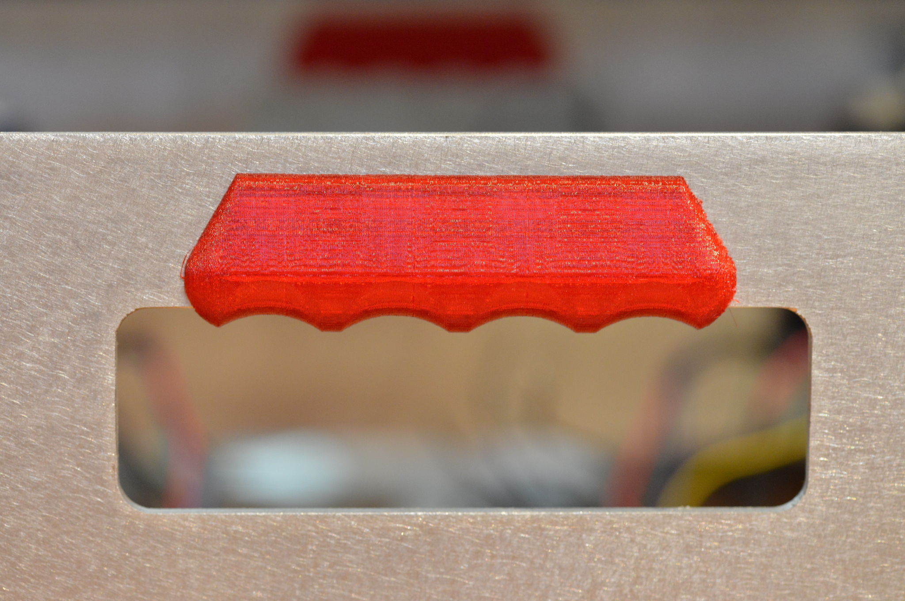
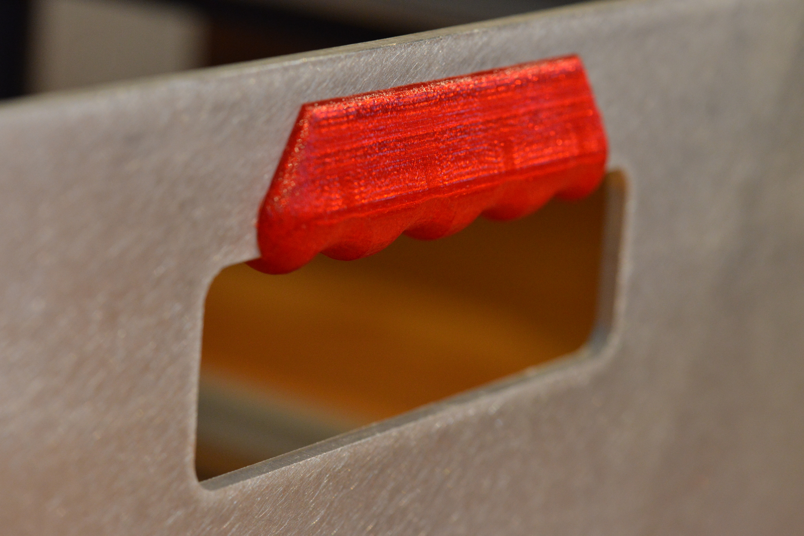
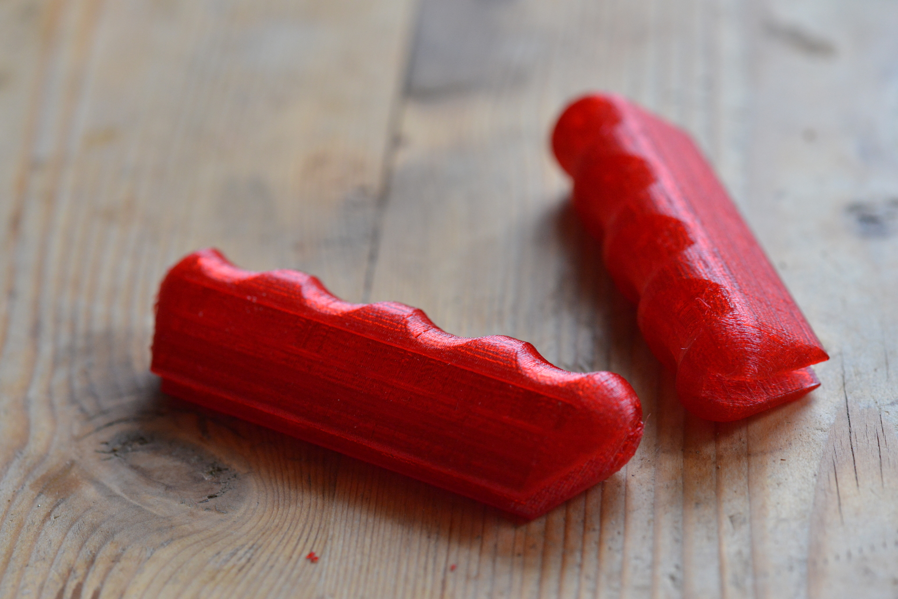
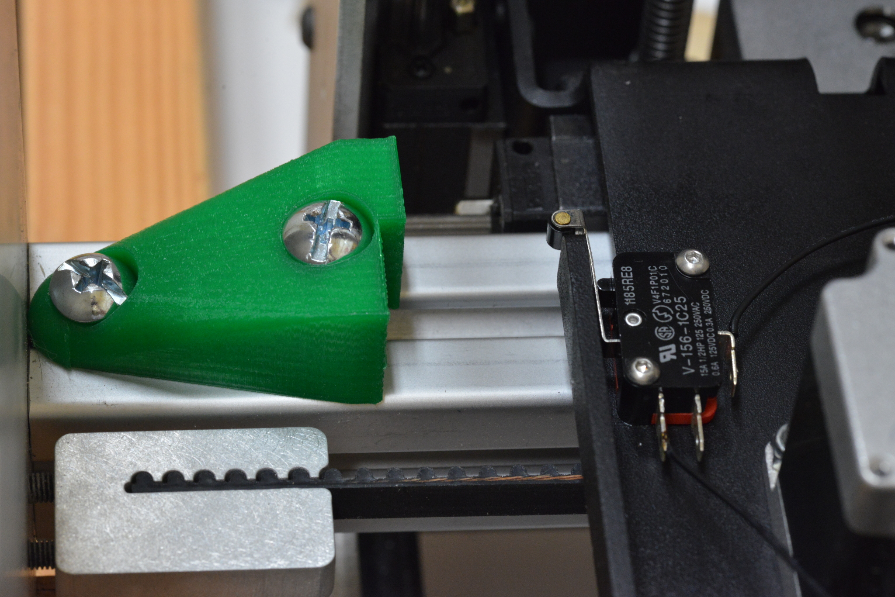
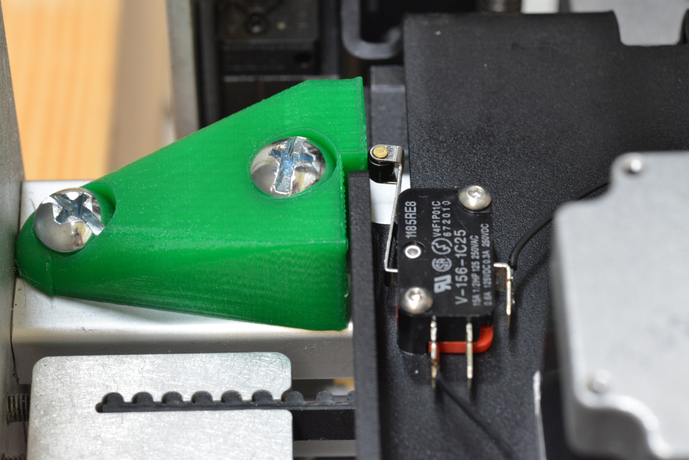
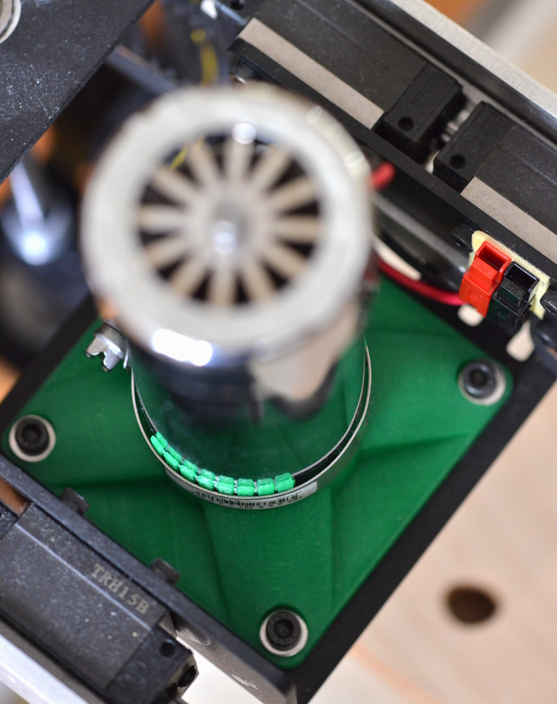

Addon-hacks for Printrbot CNC Beta 01
=====================================

Everything here free to use and share. License *CC BY-SA 4.0*

For this machine: http://printrbot.com/shop/printrbot-cnc-beta-01/

   * [cnd-handle.scad](./cnc-handle.scad) : Taking the finger-pain out of
     carrying around cutting edge technology :)
   * [y-endstop-trigger.scad](./y-endstop-trigger.scad) : For a modification
     that mounts the y-endswitches under the moving tray, these are the
     stationary triggers mounted on the rail.
   * [x-switch-spacer.scad](./x-switch-spacer.scad) : The default mount of the
     switches on the x-axis is too low so that they are not triggered reliably.
     These standoffs, mounted under th switches fixes it.
   * [spindle-holder.scad](./spindle-holder.scad): Mount of a spindle. This helps to
     mount a spindle in the screw mounts of the CNC; the spindle itself is held with a
     hose clamp. The top part needs to have slots cut with a saw (printing them makes
     stuff too fragile), see image.

## Handle
(the latest version in git is a bit bigger, better fitting hands)

## Y-endswitch mount

## Spindle Holder

