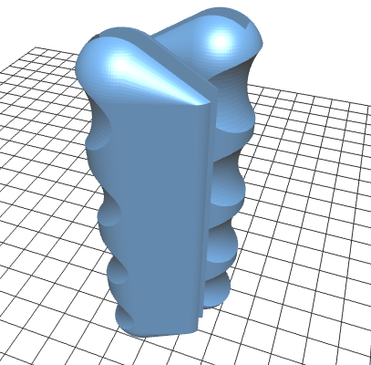

Addon-hacks for Printrbot CNC Beta 01
=====================================

Everything here free to use and share. License *CC BY-SA 4.0*

For this machine: http://printrbot.com/shop/printrbot-cnc-beta-01/

   * [cnd-handle.scad](./cnc-handle.scad) : Taking the finger-pain out of
     carrying around cutting edge technology :)
   * [y-endstop-trigger.scad](./y-endstop-trigger.scad) : For a modification
     that mounts the y-endswitches under the moving tray, these are the
     stationary triggers mounted on the rail.
   * [x-switch-spacer.scad](./x-switch-spacer.scad) : The default mount of the
     switches on the x-axis is too low so that they are not triggered reliably.
     This fixes it.

## Handle looks
(the latest version in git is a bit bigger, better fitting hands)
![Front view][handle-front]

![Side view][handle-side]

![Fresh from printer][handle-printed]

## Y-endswitch mount

![Open][y-open]
![Triggered][y-triggered]

[handle-printed]: ./img/handle-printed.jpg
[handle-front]: ./img/handle-front.jpg
[handle-side]: ./img/handle-side.jpg
[y-open]: ./img/y-open.jpg
[y-triggered]: ./img/y-triggered.jpg
